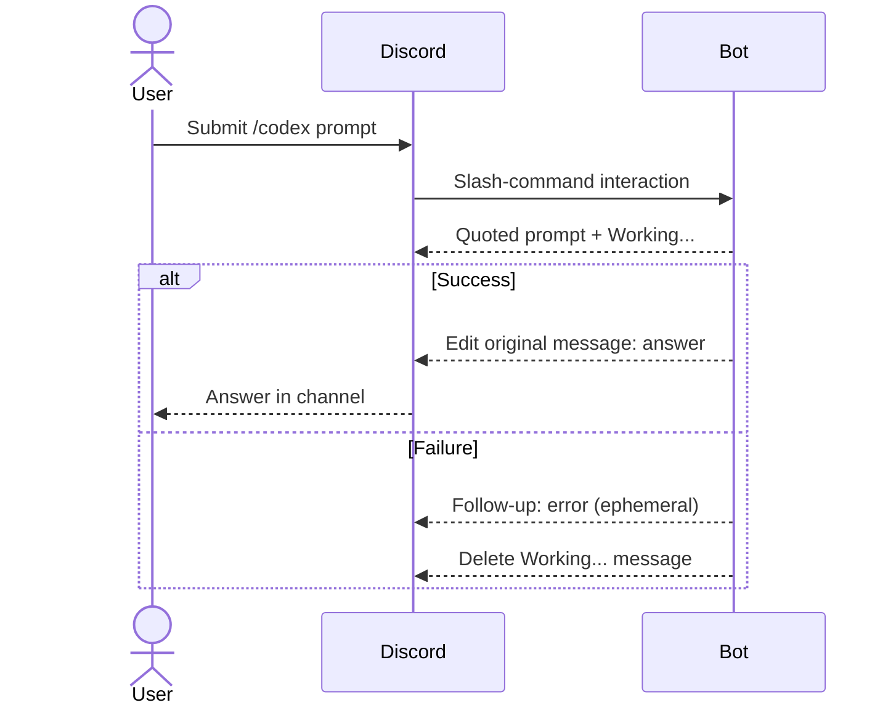
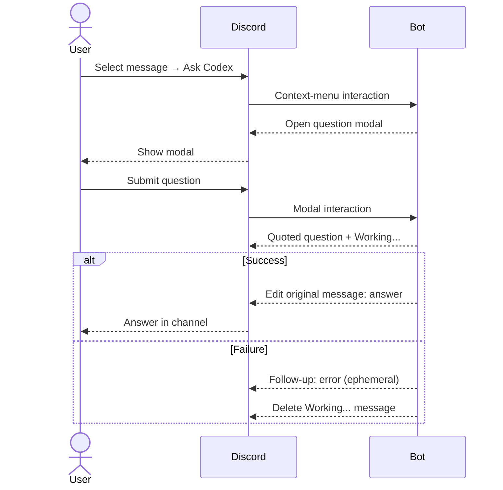
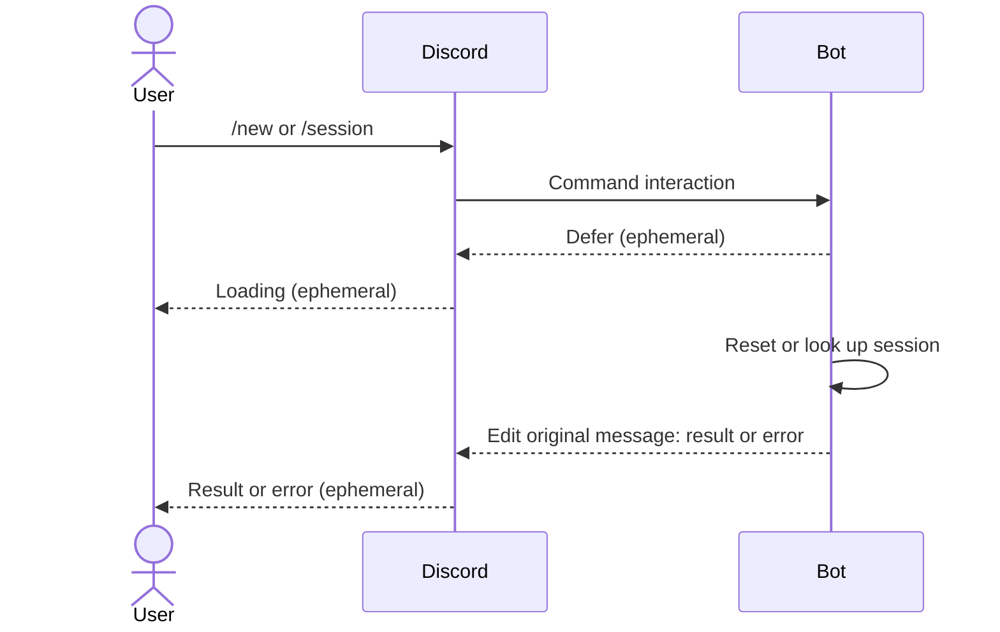

# Personal Codex Discord Bot

A single-user Discord User Install app for Codex chats via ChatGPT OAuth. It supports live web search and public pages; local tools remain disabled.

## Configure

Create a Discord app, enable **User Install** with `applications.commands`, and install it on your account. Copy the sample settings and enter your bot token and Discord user ID:

```sh
cp .env.sample .env
```

`CODEX_MODEL` is optional. Docker Compose reads `.env` automatically; Git and the image exclude it.

## Run locally

Build the local image and complete device-code login before starting the bot:

```sh
docker compose -f compose.yaml -f compose.dev.yaml build
docker compose -f compose.yaml -f compose.dev.yaml run --rm bot check-config
docker compose -f compose.yaml -f compose.dev.yaml run --rm bot login
docker compose -f compose.yaml -f compose.dev.yaml up -d
docker compose logs --tail 30 bot
```

Follow the URL and code printed by `login`. The `discord_ready` log event indicates that the bot has connected.

After local changes, run `docker compose -f compose.yaml -f compose.dev.yaml up -d --build`.

## Deploy

Only `main` publishes SHA-tagged images to `ghcr.io/lcy0321/codex-discord-bot`. Keep `.env` on the server. GHCR packages start private; [authenticate](https://docs.github.com/en/packages/working-with-a-github-packages-registry/working-with-the-container-registry#authenticating-to-the-container-registry) before the first pull.

After CI publishes the `main` image, deploy it from the server's repository checkout:

```sh
git fetch origin main
git switch --detach origin/main
export IMAGE_TAG="$(git rev-parse HEAD)"
docker compose pull bot
docker compose up -d --no-build
```

On first deployment, run `docker compose run --rm bot check-config` and `docker compose run --rm bot login` before `up`. To roll back, run `git switch --detach <previous-published-commit-sha>`, then repeat the `IMAGE_TAG`, `pull`, and `up` commands. Export `IMAGE_TAG` again in each new shell.

## Use

| Command | Result | Visibility |
| --- | --- | --- |
| `/codex prompt:…` | Continue the conversation in this channel or thread. | Normal channel reply |
| Message menu → **Apps → Ask Codex** | Ask about the selected message's text or image. | Normal channel reply |
| `/session` | Show this channel's Codex thread ID. | Ephemeral |
| `/new` | Start a fresh conversation here on the next message. | Ephemeral |

Channels and threads have separate conversations. For private chats, use a channel only you can see; direct messages to the bot remain unverified.

### Response flow

`/codex` edits its `Working...` message into the answer:



`Ask Codex` opens a modal. Its submission starts a new interaction whose `Working...` message becomes the answer:



Both paths send an initial message rather than defer: Discord would turn the first ephemeral error follow-up after a defer into an edit without changing visibility. Input rejected before the `Working...` message gets an ephemeral initial response.

`/new` and `/session` use ephemeral responses:



## Operate and recover

Use `docker compose logs -f bot` for logs and `docker compose restart bot` to restart. Keep one bot instance running; `docker compose run bot` starts another.

The `codex-discord-bot_state` volume stores OAuth credentials and conversation state. Restarts, updates, and `docker compose down` retain it; `docker compose down -v` deletes it. If authentication fails, stop the bot before refreshing:

```sh
docker compose stop bot
docker compose run --rm bot auth-status --refresh
```

If refresh fails, run `docker compose run --rm bot login`. Then run `docker compose up -d`.

Back up the entire volume with the bot stopped. The archive in Git-ignored `.state` contains credentials and private conversations:

```sh
docker compose stop bot
mkdir -p .state
docker run --rm \
  -v codex-discord-bot_state:/state:ro \
  -v "$PWD/.state:/backup" \
  alpine:3 tar -C /state -czf /backup/state.tar.gz .
```

Restoring replaces the current volume:

```sh
docker compose down
docker volume rm codex-discord-bot_state
docker compose create bot
docker run --rm \
  -v codex-discord-bot_state:/state \
  -v "$PWD/.state:/backup:ro" \
  alpine:3 tar -C /state -xzf /backup/state.tar.gz
docker compose start bot
```

`sessions.toml` cannot resume Codex threads without runtime history. If a reply fails after the model ran, check `/session` before retrying; the turn may already be saved.

## Develop

Local development requires Python 3.14 and [uv](https://docs.astral.sh/uv/). From the repository root:

```sh
uv sync --locked
uv run ruff format --check .
uv run ruff check .
uv run pyrefly check
uv run python -m pytest
```

The tests do not need `.env`, Discord, or OAuth.
